# **Manual Técnico**

Requisitos minimos del Sistema Operativo para ejecutar el programa:

- Windows 10 (8u51 y superiores)
- Windows 8.x (escritorio)
- Windows 7 SP1
- Windows Vista SP2
- RAM: 128MB
- Espacio en Disco: 124 MB para python
- Procesador: Minimo Pentium 2 a 266 M

## **Diccionario de librerías**

### Libreria Tkinter:
- Tkinter es una libreria que funciona para la creación y el desarrollo de aplicaciones de escritorio. Esta librería facilita el posicionamiento y desarrollo de una interfaz gráfica de escritorio con python. TK se describe a sí mismo como el único toolkit o kit de herramientas para el desarrollo de una interfaz gráfica de usuario.

### Módulo "os"
- Este módulo provee una manera versátil de usar funcionalidades dependientes del sistema operativo. Si se desea manipular rutas, se realiza gracias al modulo os.path

## Diccionario de Variables Globales

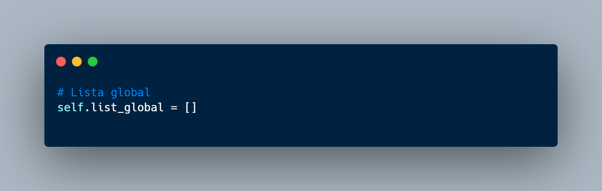

Se inicializa una lista global, la cual es la encargada de almacenar toda la información relacionada al programa

- self.list_global = [ ] - Esta lista almacena una serie de objetos los cuales contienen los cursos que han sido añadidos, eliminados, editatos, etc. que facilitan su acceso debido a ser una variable global.

## **Diccionario de Clases**

### **Class Menu**

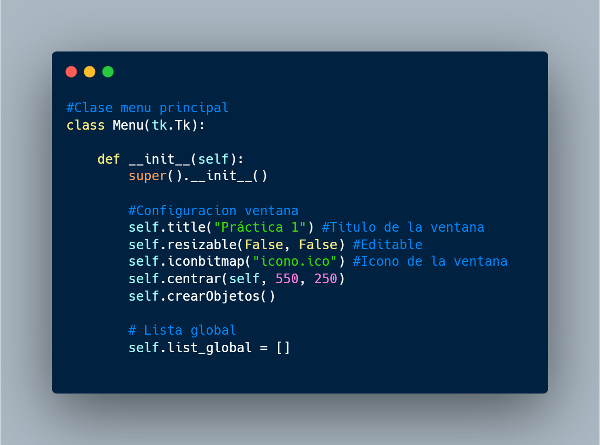

La clase menu es la clase principal, la cual hereda de la clase Tk.tk, la cual es necesaria para crear la ventana principal en donde se añaden todas las demas ventanas para formar toda la ingerfaz grafica del programa, ademas de iniciar la variable self.list_global.

### **Class Cursos**

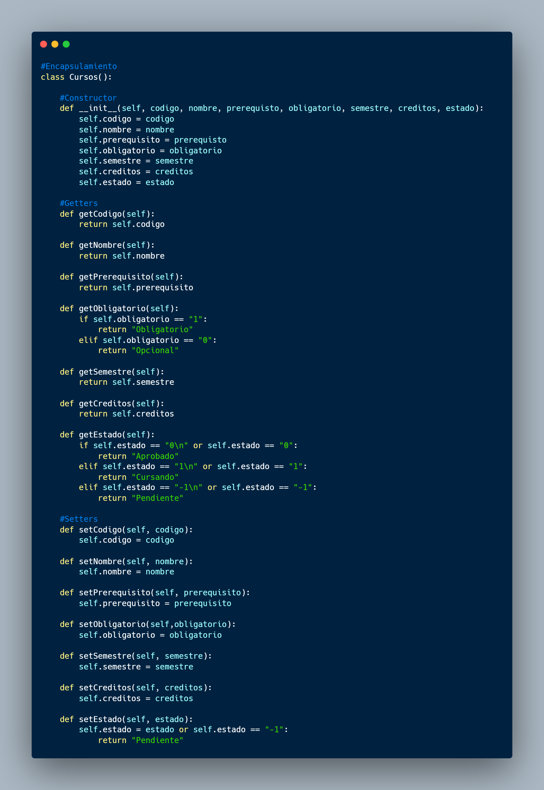

La clase cursos es la encargada del encapsulamiento de datos, la cual recibe como parametros todos los datos que se almacenaran dentro de la lista global, datos que se utilizan durante todo el programa. En esta clase se crean todos los metodos getters y setters, ademas de su constructor, para inicializar sus valores.

### **Class AbrirArchivo**

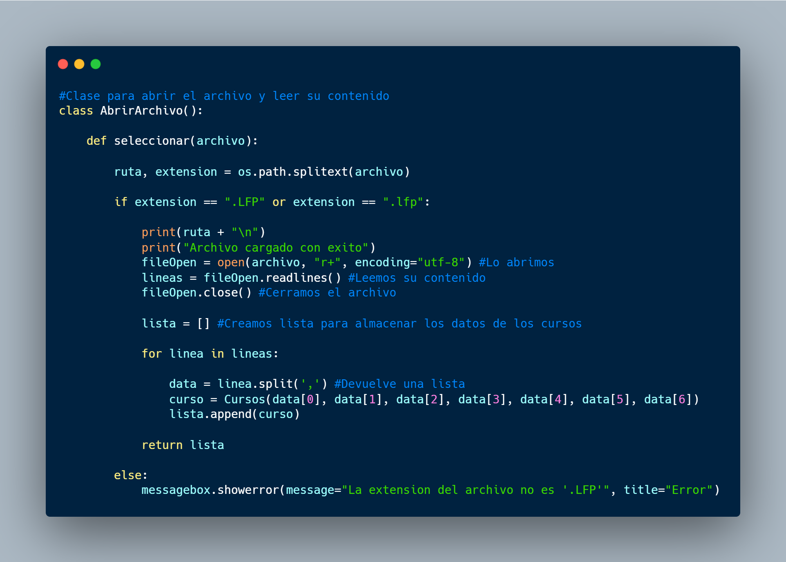

La clase AbrirArchivo, es la encargada de abrir un archivo con extension .lfp, para poder leer su contenido y almacenar los mismos dentro de una lista y asimismo retornar la lista, para poder ser utilizada a lo largo de todo el programa.

## **Diccionario de Funciones**

### **Función seleccionar**

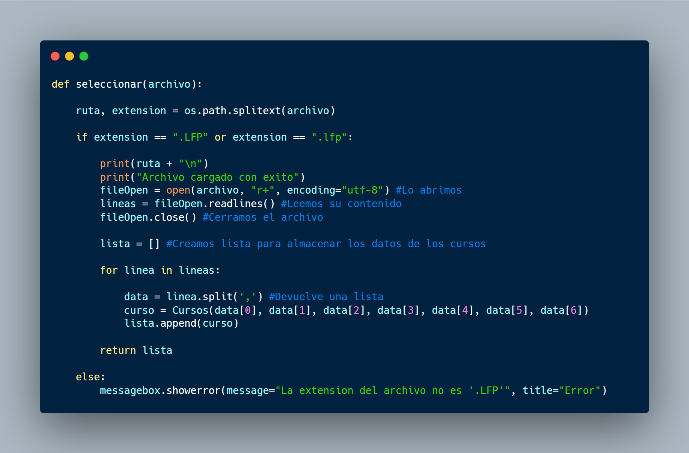

La funcion seleccionar recibe como parametro una ruta de un archivo seleccionado, para posteriormente verificar si la extensión de dicho archivo es exactamente ".lfp", y si esta no es de dicha extensión brinda un mensaje de error. En caso de ser la correcta, abre el archivo leyendo su contenido e iterando su contenido mediante un ciclo, para almacenar el contenido dentro de una lista.

### **Función crearObjetos**

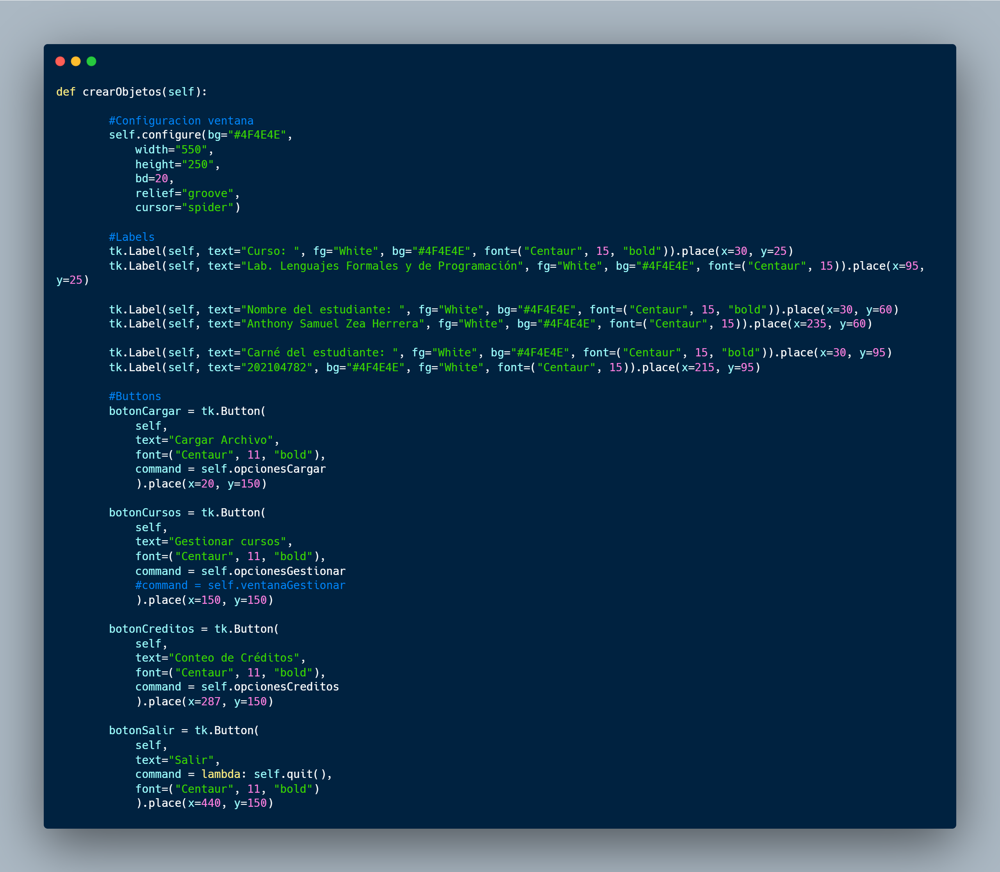

Esta funcion es la encargada de crear todos los objetos necesarios para manipular y crear toda la interfaz grafica principal con sus widgets ubicados con precisión. 

### **Función cargarFile**

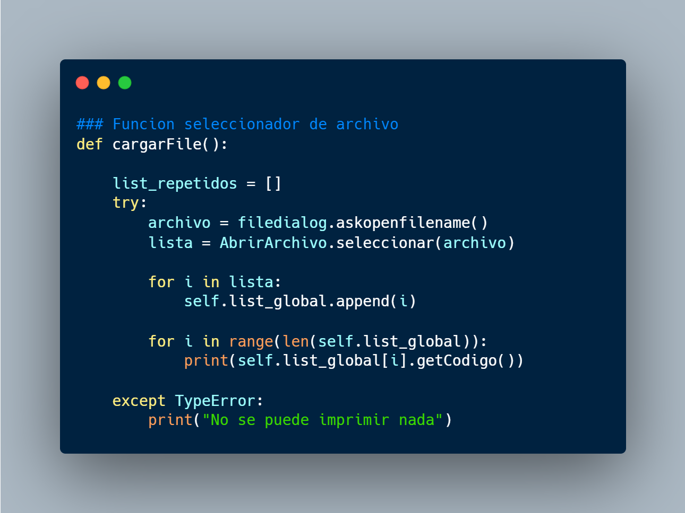

Esta función es la encargada de abrir una ventana emergente para poder seleccionar un archivo y posteriormente enviar la ruta del archvivo a la funcion seleccionar, y luego iterar dentro de un ciclo para almacenar los datos de la lista, en la lista global.

### **Función listarCursos**

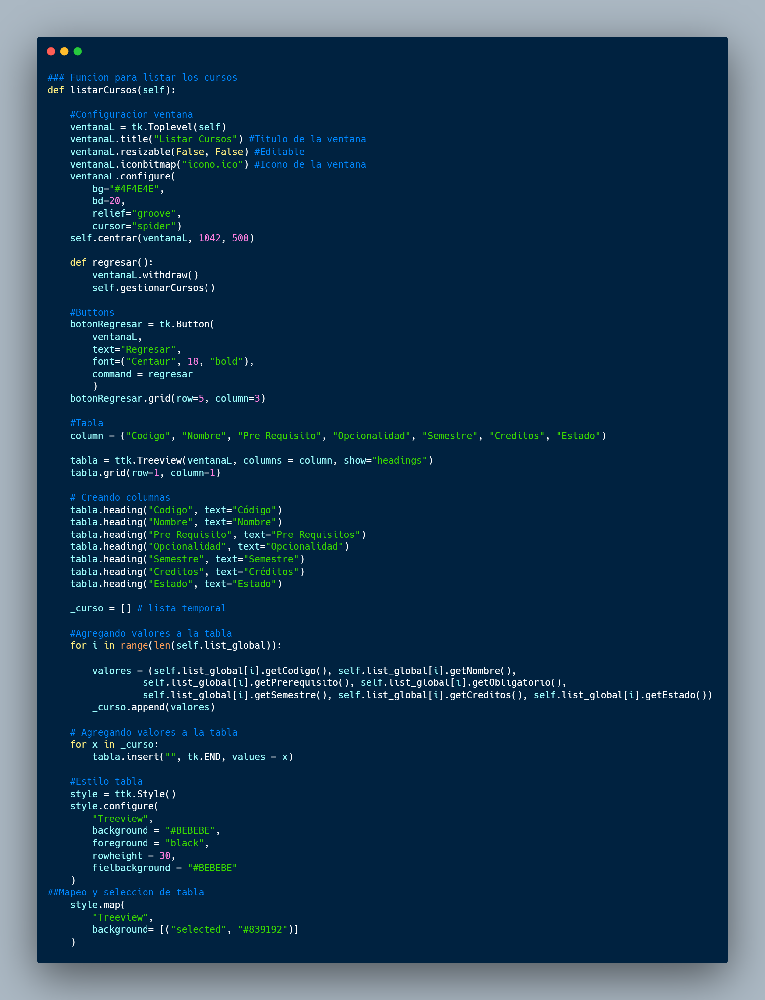

Esta función crea la ventana juntamente con la tabla necesaria para visualizar todos los cursos de manera grafica, cursos que han sido agregados dentro del sistema, mostrado cada parametro en un tabla dinamica.

### **Función viewCurso**

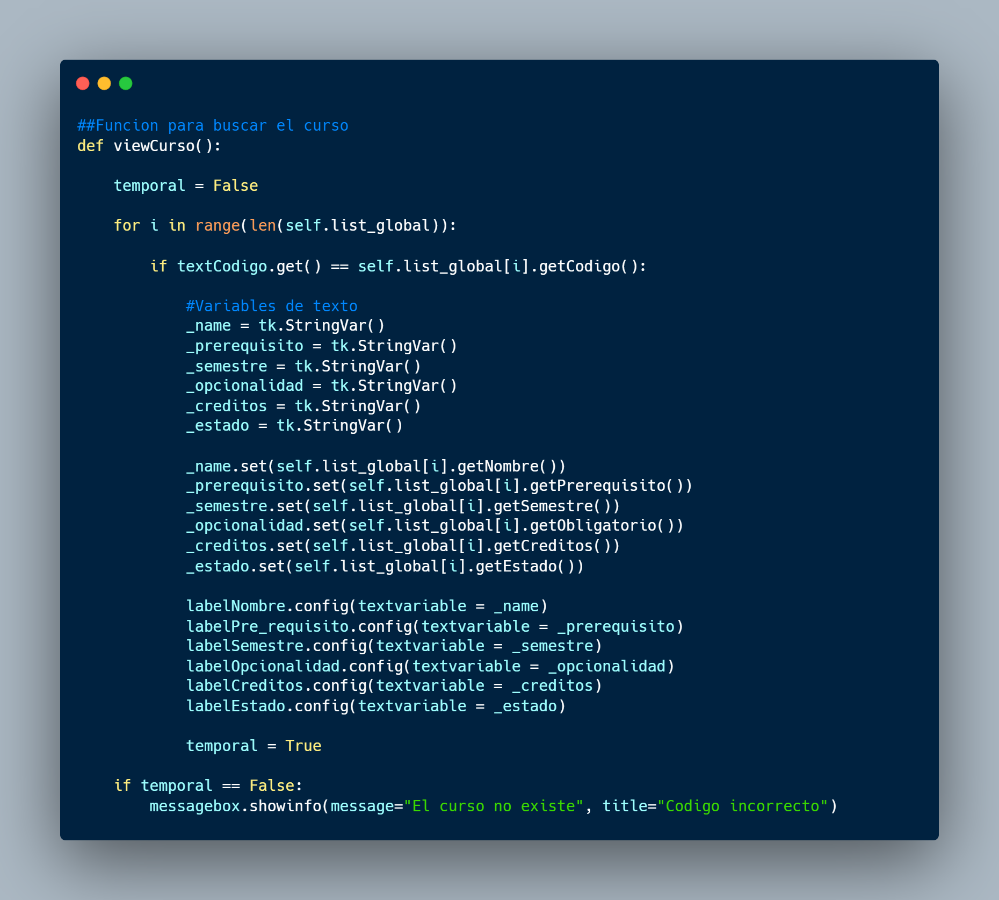

Esta función es la encargada primeramente de verificar que el codigo de curso que se este ingresando en la caja de texto, se encuentre existente en la lista de cursos, para posteriormente mostrar cada uno de los parametros correspondientes al codigo ingresado.

En caso que el codigo que se ingrese no exista dentro del sistema, la funcion mostrara un mensaje de error haciendo saber que esta ingresando un codigo inexistente.

### **Función addCurso**

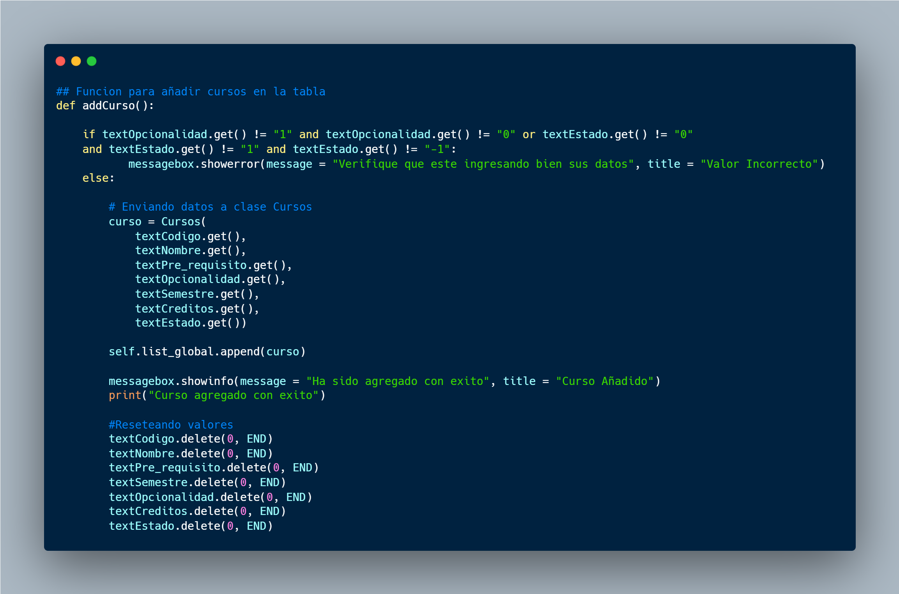

Esta función es la encargada primeramente de verificar que los valores que se ingresen dentro de las cajas de texto de opcionalidad y estado, admitan unicamente valores "1", "-1" o "0", y en caso de ser asi, agregara el contenido que se ha ingresado en las cajas de texto en la lista.

### **Función editCurso**

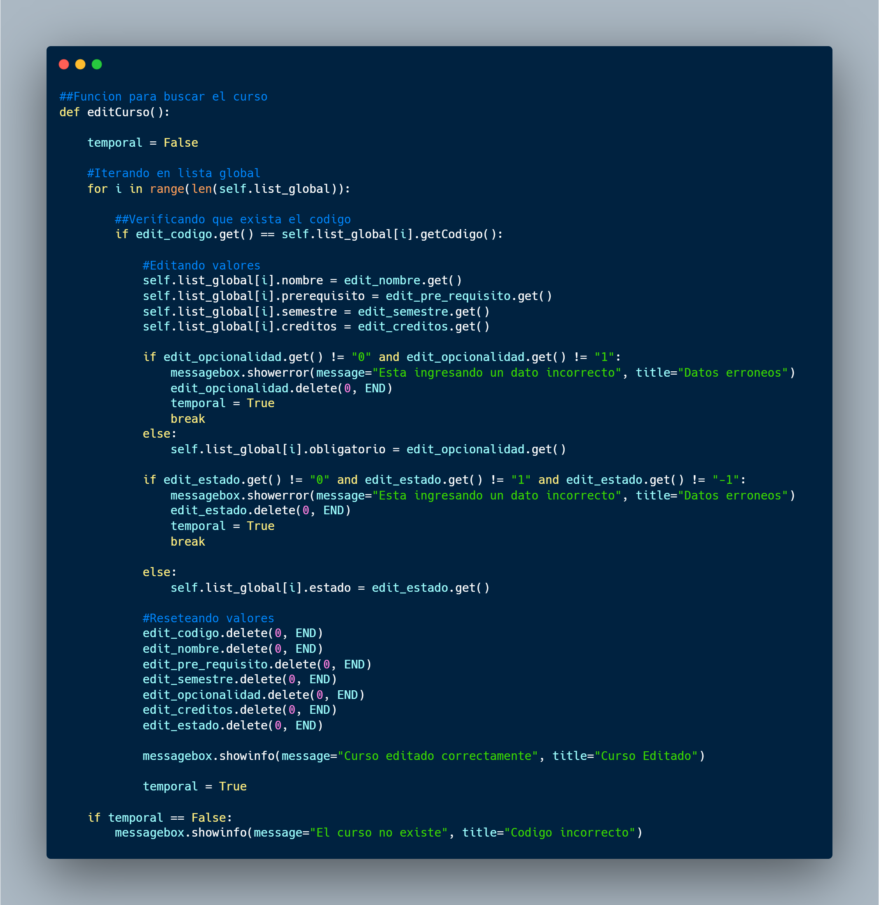

Dicha función es la encargada primeramente de verificar que el codigo que se este ingresando en la caja de texto, sea el codigo de un curso que si exista.

En el caso que el codigo exista, se itera para añadir los valores que han sido modificados en la lista.

En caso contrario, manda un mensaje el cual muestra que el codigo no existe dentro del sistema.

### **Función deleteCurso**

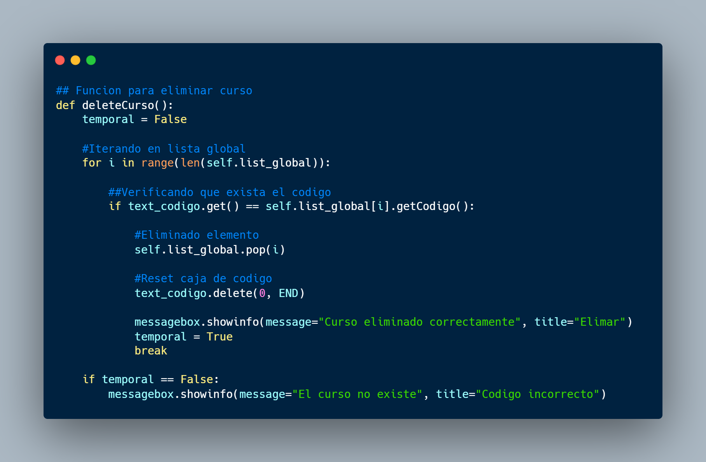

Esta función tiene la unica finalidad de buscar el codigo que se esta ingresando dentro de la caja de texto, para eliminar completamente de la lista global, el curso como tal.

Si el codigo se encuentra realiza la accion, de no ser asi, mostrara un mensaje de error, que el codigo ingresado no existe.

### **Función countN**

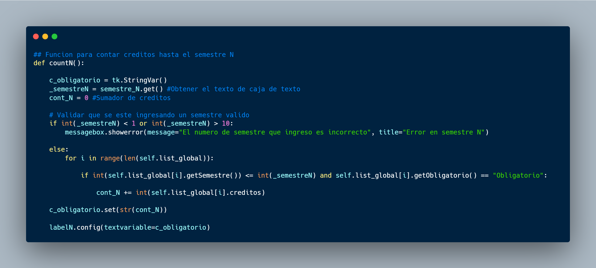

Esta función es la encargada, primeramente de verificar que el semestre que se este ingresando este entre 1 y 10, y posterior a ello, iterar para sumar todos los creditos, que esten con el estado "Obligatorio", hasta el semestre indicado.

En el caso que se ingrese un semestre que no este dentro de ese rango, especificara un error de numero de semestre.

### **Funcion countS**

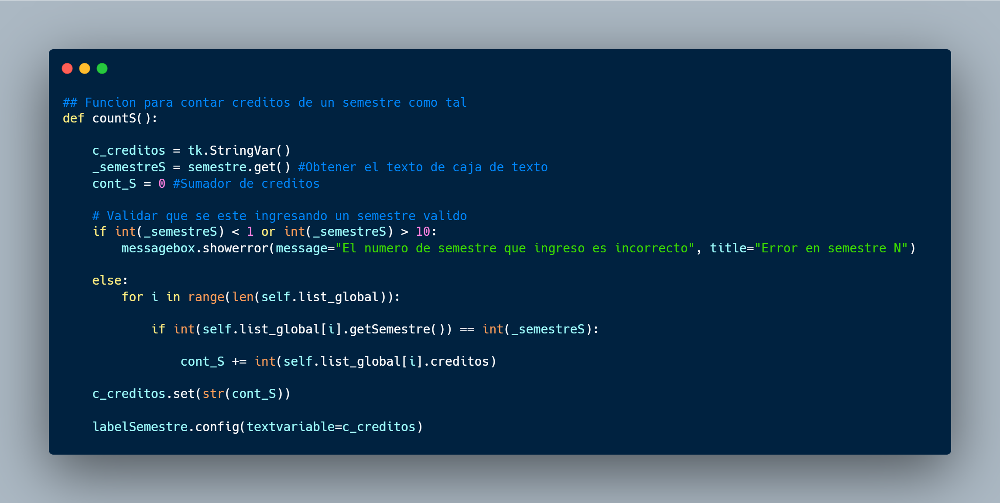

Esta función es la encargada primeramente de verificar que el semestre que se este ingresando este entre 1 y 10, y posterior a ello, iterar dentro de la lista, para sumar todos los creditos con el estado cursando, pendiente y aprobado, solamente del semestre indicado.

En el caso que se ingrese un semestre que no este dentro de ese rango, especificara un error de numero de semestre.

### **Función countCreditos**

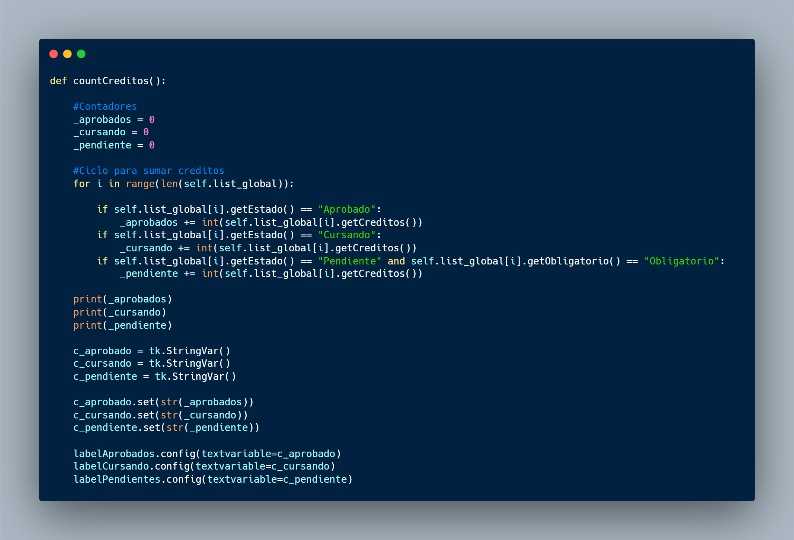

Esta funcion es la encargada unicamente de hacer una sumatoria de todos los creditos que se encuentren dentro del sistema, separandolos por los cursos que esten con el estado "Aprobado", "Cursando" y "Pendiente".

Con estos valores crea una variable de texto para poder mostrar los resultados, dentro de unas etiquetas o labels.