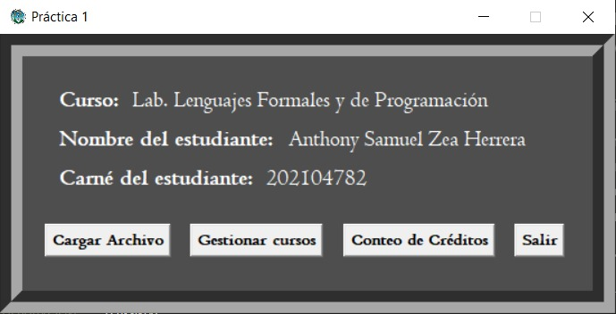
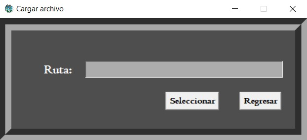
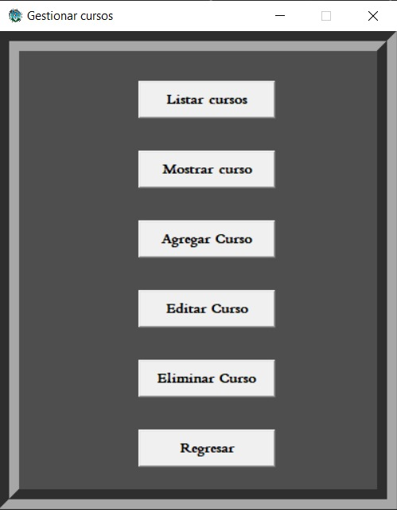
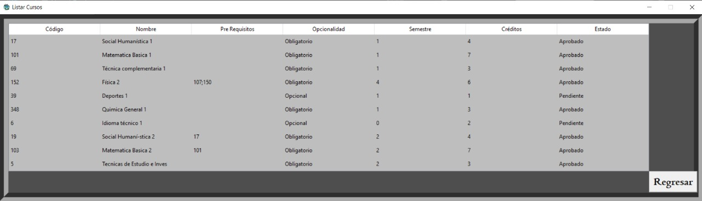
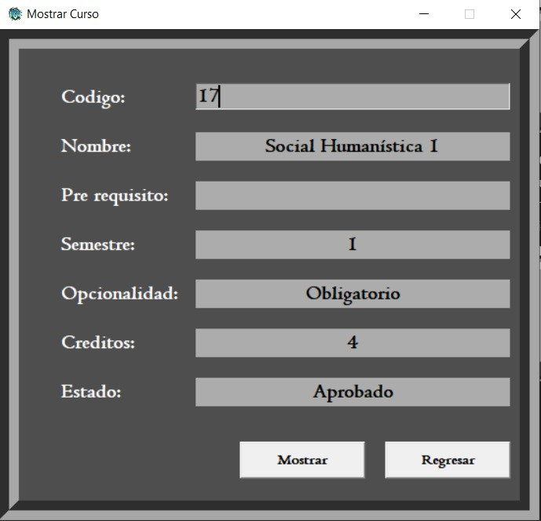
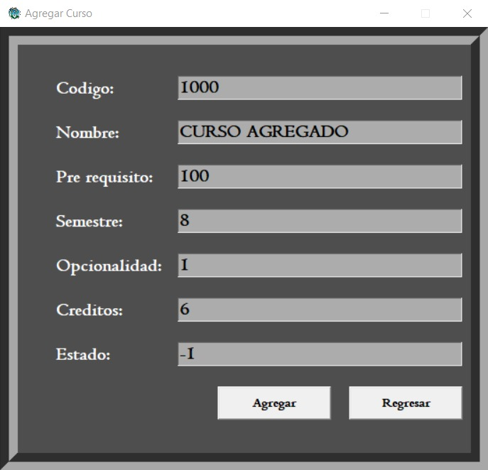
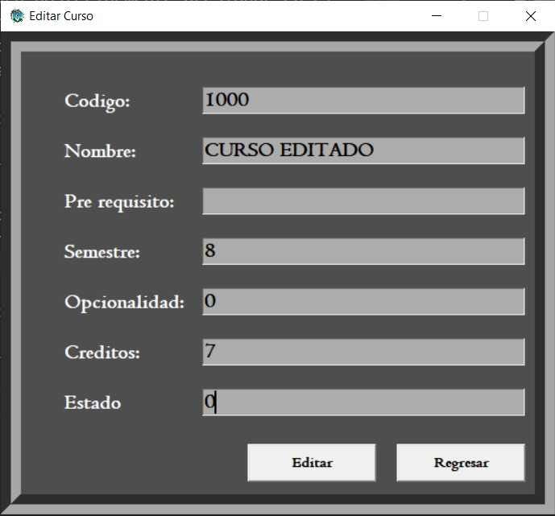
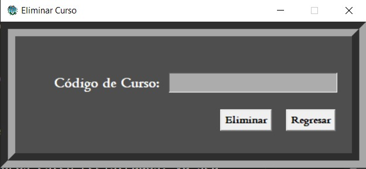
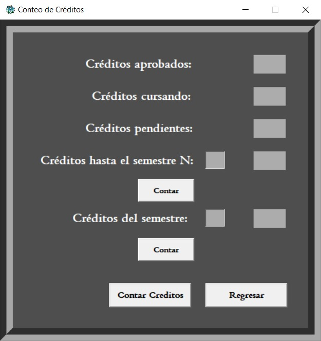

# Pensum de estudios

El programa es capaz de llevar un control de cursos que esten asignados en un semestre especifico, con funcionalidades para contar creditos de un semestre en especifico, o contar los creditos que se llevan hasta cierto semestre.

Es capaz de mostrar la información mediante una tabla dinamica en la que se visualiza de manera intuitiva y grafica toda la información relacionada a los cursos.

Además de poder hacer un conteo de creditos, permite identificar si un curso es opcional u obligatorio, ademas de verifiar si el curso ha sido aprobado, o esta siendo cursando o esta pendiente.

El sistema es capaz de editar, agregar y eliminar cursos que se encuentren en la lista de cursos del archivo cargado masivamente.

## Menu Principal

Cuenta con interfaz sencilla y minimalista, que le permite al usuario poder ingresar a la opcion de cargar cursos, gestionar cursos, realizar un conteo de creditos oh ya bien sea, salir del programa.

Ademas de las funcionalidades especificas del programa, muestra también los datos correspondientes al creador de dicho programa juntamente con el nombre del curso propietario del sistema de pensum de estudio.

## Ventana Cargar Archivo

Al presionar el boton Cargar Archivo, el sistema abrira la ventana para poder seleccionar y cargar un archivo. Para realizarlo simplemente basta con dar click en el boton Seleccionar y una ventana emergente se abrira, para poder seleccionar el archivo que deseemos.

El boton regresar permite volver a visualizar la ventana del menu principal.

## Ventana Gestionar Cursos

Al presionar el boton Gestionar cursos del menu principal mostrara esta ventana, en la cuál se encuentran 6 botones con la funcionalidad especificada en cada uno de ellos.

- **Listar Cursos**: Dentro de esta ventana se visualiza una tabla con cada columna especificada para mostrar todos los parametros de un curso en especifico, listandolos mediante una tabla.

    

- **Mostrar Curso**: Dentro de esta ventana se visualiza una caja de texto, en la que el usuario puede ingresar el codigo de un curso, para posteriormete presionar el boton "Mostrar" y automaticamente el sistema mostrara toda la información correspondiente a ese curso.

    

- **Agregar Curso**: Dentro de esta ventana se visualiza los datos de un curso como tal, en el que el usuario podra ingresar cada uno de ellos manualmente para posteriormente presionar en el boton "Agregar", y automaticamente el sistema agregara ese curso a la lista de todos los cursos en el sistema

    

- **Editar Curso**: Dentro de esta ventana se visualiza los datos de un curso como tal, en el que el usuario podra ingresar los datos correspondientes a un curso que ya este añadido con anterioridad en el sistema, esto con el unico fin, de editar los parametros especificos de ese curso. En el caso que el curso no existe, el usuario verificara que el curso no existe.

    

- **Eliminar Curso**: Dentro de esta ventana se visualiza una caja de texto, en la cual el usuario debera ingresar el codigo de un curso que ya este añadido en la lista total de cursos, para poder eliminarlo del sistema, simplemente con presionar el boton "Eliminar". Al hacer esta accion el curso quedara eliminado totalmente, y en el caso que el codigo de curso no exista, se le notificara al usuario esta acción.

    

- **Regresar**: Al presionar este boton le permite al usuario poder regresar al menú principal.

## Ventana Conteo de Creditos

Al presionar el botón "Conteo de Creditos", el usuario verificara toda la interfaz necesaria para poder realizar un conteo de los creditos de los cursos que estan añadidos dentro del sistema:

En la parte inferior de dicha ventana se encuentra el boton "Contar Creditos", el cual al ser presionado por el usuario, mostrara el total de creditos de los cursos que han sido agregados con los estados: aprobados, cursando y pendientes.

- Créditos hasta el semestre N: En esta opcion el usuario debera ingresar un numero de semestre, y al presionar el boton "Contar" justo abajo de esta etiqueta, el programa calculara el total de creditos desde el semestre 1, hasta el semestre indicado, tomando en cuenta unicamente los cursos con opcionalidad "Obligatorio".
- Creditos del semestre: En esta opcion el usuario debera ingresar un numero de semestre, y al presionar el boton "Contar" justo abajo de esta etiqueta, el programa calculara el total de creditos de ese semestre, contando todos los cursos con estado "Pendiente", "Cursando" y "Aprobado" para asi mostrar, el total de creditos de ese semestre en especifíco.
- Regresar: Al presionar el boton "Regresar", el usuario podra visualizar nuevamente el menu principal.

## Salir
Por ultimo, el usuario podra salir del programa totalmente simplemente presionando el boton "Salir".